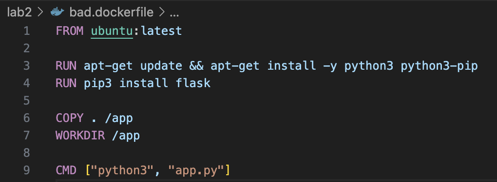
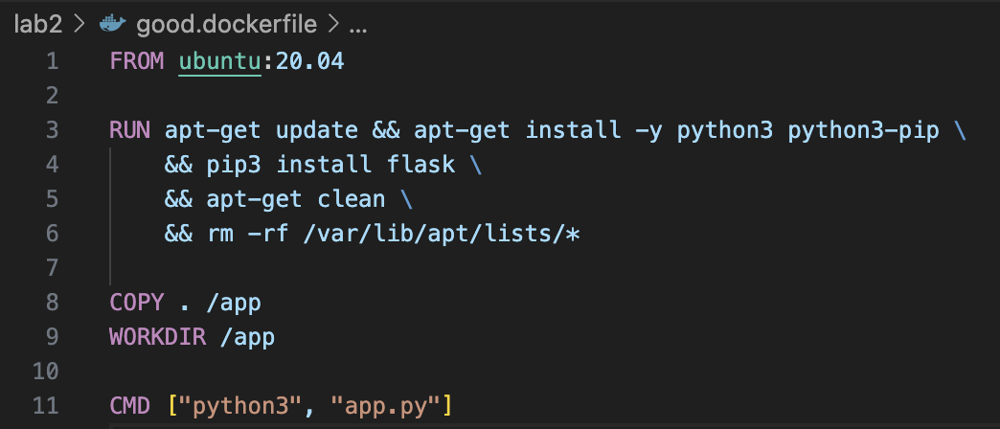

# Лабораторная работа №2

Выполнили: Команда "Буцефалы"

## “Плохой” Dockerfile

## Разберем ошибки 
1. Использование *ubuntu:latest* это плохо, потому что образ *latest* не фиксирован, это может привести к нежелательным обновленияем и конфликтам.

2. Много команд *RUN*: Каждая команда *RUN* создает новый слой и увеличивает размер образа.

3. Нет отчистки после уставновки - пакеты кэшируются, что приводик к увеличению размера образа. 

## “Хороший” Dockerfile

## Исправление ошибок
1. Фиксируем базовый образ с помощью *ubuntu:20.04*, это поможет улучшить предсказуемость сборки и поддержку.

2. Объединяем все операции в один атомарный слой *RUN*, это позволяет уменьшить количество слоев в сборке => уменьшить конечный размер образа.

3. Отчистка кэша с использованием *apt-get clean* позволяет удалить временные файлы и уменьшает размер конечного образа.

## 2 Плохие практики работы с контейнерами 

1. Запуск контейнера с правами root дает доступ к хост-системе, что может создать серьезные уязвимости, особенно если контейнер взломан. Поэтому лучше использовать специальных юзеров с ограниченными правами для запуска контейнеров.

2. Если контейнеры не ограничены по памяти и процессору, они могут использовать все ресурсы хоста, что приведет к ухудшению производительности всей системы. Можно использовать флаги для ограничение ресурсов контейнера --memory и --cpus при запуске. 
Также следует не забывать останавливать контейнер (docker stop), иначе он будет избыточно потреблять ресурсы. 